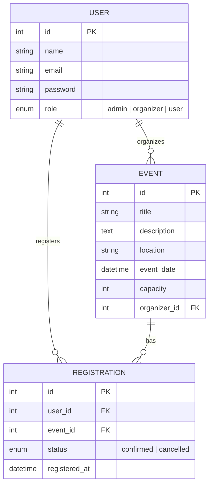

# 🎓 Event Registration System (نظام تسجيل الفعاليات)


A modern, full-stack **Event Registration & Management System** built with **Node.js, Express, Sequelize (MySQL), React 19, and Vite**. Designed for university and corporate event planning with multi-role access (Users & Organizers), real-time seat availability calculation, interactive dashboard statistics, live event search/filters, attendee management, and strict JWT authentication.

Developed as part of the Web Development Internship at **CodeAlpha**.

---

## ✨ Key Features & Enhancements

### 👤 For Regular Users
- **Browse & Search Events**: Live title/location search, status filtering (*All, Upcoming, Past, Available, Full*), and date sorting (*Nearest/Farthest first*).
- **Real-Time Registration Status**: Dynamic **"أنت مسجل بالفعل ✓"** button state with persistent backend verification across page refreshes.
- **Capacity & Seat Tracking**: Live calculation of remaining seats (`Capacity - Confirmed Registrations`) with automated fully booked disable triggers.
- **My Registrations**: View and cancel active event registrations.

### 👔 For Organizers
- **Organizer Dashboard**: Real-time statistics cards displaying:
  - 📊 Total Events
  - 📅 Upcoming Events
  - ⏳ Past Events
  - 🎟️ Total Registrations
  - 👥 Total Seats
  - 🟢 Remaining Seats
- **Dedicated "فعالياتي" (My Events) Page**: View, create, edit, and delete only the events created by the logged-in organizer.
- **Attendees Management ("إدارة المسجلين")**: Exclusive modal dialog per event listing registered user names, emails, registration dates, and statuses.
- **Ownership Protection**: Strict backend authorization ensuring organizers cannot alter or view another organizer's events or attendees.

### 🎨 UI/UX & Security Features
- **Real-Time Event Badges**:
  - 🟢 **متاحة للتسجيل** (*Available & > 3 seats*)
  - 🟡 **المقاعد محدودة** (*Limited seats <= 3*)
  - 🔴 **اكتملت المقاعد** (*Fully Booked*)
  - ⚫ **انتهت** (*Past Event*)
- **Occupancy Progress Bar**: Visual percentage fill bar (`8 / 10 مقاعد`) in event details.
- **Frontend & Backend Validation**: Prevents past-date event selection (`min` attribute + JS check) and enforces password length constraints (>= 8 characters).
- **Toast & Modals**: Smooth floating notifications for actions and reusable modal confirmations for sensitive operations.
- **Custom Branding & Theme**: Custom Navy & Gold Graduation Cap SVG favicon, unified CSS variable design system, and a responsive 404 page.

---

## 🛠 Tech Stack

| Layer | Technology |
|---|---|
| **Backend Runtime** | Node.js |
| **Backend Framework** | Express.js |
| **Database & ORM** | MySQL + Sequelize ORM |
| **Authentication** | JWT (`jsonwebtoken`) + `bcryptjs` |
| **Frontend Framework** | React 19 (Vite 8) |
| **UI Components** | React Bootstrap 5 + React Icons |
| **HTTP Client** | Axios (with Interceptors) |
| **Styling** | Custom Vanilla CSS (Design System Tokens) |

---

## 📐 Entity Relationship Diagram (ERD)



---

## 📡 API Endpoints

### 🔐 Authentication (`/api/auth`)
| Method | Endpoint | Description | Auth Required | Role |
|---|---|---|---|---|
| `POST` | `/api/auth/register` | Register new User or Organizer account | No | Public |
| `POST` | `/api/auth/login` | Authenticate user & return JWT token | No | Public |

### 📅 Events (`/api/events`)
| Method | Endpoint | Description | Auth Required | Role |
|---|---|---|---|---|
| `GET` | `/api/events` | Fetch all events (supports pagination & registration count) | No | Public |
| `GET` | `/api/events/my` | Fetch logged-in organizer's events + dashboard statistics | Yes | `organizer` |
| `GET` | `/api/events/:id` | Fetch detailed info for a specific event | No | Public |
| `GET` | `/api/events/:eventId/registrations` | Fetch attendee list for an event owned by organizer | Yes | `organizer` |
| `POST` | `/api/events` | Create a new event | Yes | `organizer` |
| `PUT` | `/api/events/:id` | Update an existing event (Ownership check) | Yes | `organizer` |
| `DELETE` | `/api/events/:id` | Delete an event (Ownership check) | Yes | `organizer` |

### 🎟️ Registrations (`/api/registrations`)
| Method | Endpoint | Description | Auth Required | Role |
|---|---|---|---|---|
| `POST` | `/api/registrations/:eventId` | Register logged-in user for an event | Yes | `user` |
| `PUT` | `/api/registrations/cancel/:id` | Cancel a confirmed registration | Yes | `user` |
| `GET` | `/api/registrations/my` | Fetch logged-in user's active registrations | Yes | All Users |

---

## ⚡ Quick Start & Running Locally

### Prerequisites
- Node.js (v18+)
- MySQL Server running locally or remotely

### 1. Backend Setup
```bash
cd backend
npm install
```

Configure environment variables in `backend/.env`:
```env
PORT=5000
DB_NAME=event_registration_db
DB_USER=root
DB_PASSWORD=your_password
DB_HOST=127.0.0.1
DB_DIALECT=mysql
JWT_SECRET=your_super_secret_jwt_key
```

Seed initial database schema & demo data:
```bash
node seed.js
```

Start backend dev server:
```bash
npm run dev
```

### 2. Frontend Setup
```bash
cd frontend
npm install
npm run dev
```

Open [http://localhost:5173](http://localhost:5173) in your browser.

---

## 🔑 Demo Login Credentials

You can use the seeded test credentials to test all roles immediately:

| Role | Email | Password | Features to Test |
|---|---|---|---|
| **Organizer (منظّم)** | `ahmed@organizer.com` | `Password123!` | Dashboard Stats, "فعالياتي", Attendees Modal, Edit/Delete Events |
| **Organizer (منظّم)** | `sara@organizer.com` | `Password123!` | Dashboard Stats, Event Management |
| **User (مستخدم)** | `ali@user.com` | `Password123!` | Event Registration, "أنت مسجل بالفعل ✓", "تسجيلاتي" |

---

## 📁 Project Structure

```
EventRegistrationSystem/
├── backend/
│   ├── config/
│   │   └── db.js                 # Sequelize MySQL Connection
│   ├── controllers/
│   │   ├── authController.js     # Signup & Login logic
│   │   ├── eventController.js    # Event CRUD & Dashboard Statistics
│   │   └── registrationController.js # Event Registration & Attendees
│   ├── middleware/
│   │   ├── asyncWapper.js        # Async error wrapper
│   │   └── authMiddleware.js     # JWT Protect & Organizer Authorization
│   ├── models/
│   │   ├── User.js               # User Schema (Role: admin, organizer, user)
│   │   ├── Event.js              # Event Schema
│   │   └── Registration.js       # Registration Schema & Associations
│   ├── routes/
│   │   ├── authRoutes.js
│   │   ├── eventRoutes.js
│   │   └── registrationRoutes.js
│   ├── seed.js                   # Demo Data Seeder Script
│   └── server.js                 # Server Entry & DB Sync
│
└── frontend/
    ├── public/
    │   └── favicon.svg           # Custom Navy & Gold SVG Favicon
    └── src/
        ├── api/
        │   └── axios.js          # Intercepted Axios Instance
        ├── components/
        │   ├── ConfirmModal.jsx  # Reusable Confirmation Modal
        │   ├── EventCard.jsx     # Event Card with Real-time Status Badges
        │   ├── Loader.jsx        # Custom Spinner
        │   ├── Navbar.jsx        # Role-aware Navigation Bar
        │   ├── ProtectedRoute.jsx# Auth & Role Guard
        │   └── Toast.jsx         # Floating Notification Toast
        ├── context/
        │   └── AuthContext.jsx   # Global Auth Provider
        ├── pages/
        │   ├── CreateEvent.jsx   # Create Event Form with Validation
        │   ├── EditEvent.jsx     # Edit Event Form
        │   ├── EventDetails.jsx  # Event Details & Attendees Modal
        │   ├── Home.jsx          # All Events with Search, Filter & Sort
        │   ├── Login.jsx         # Login Form
        │   ├── MyEvents.jsx      # Organizer Dashboard & My Events
        │   ├── MyRegistrations.jsx# User Registrations Page
        │   ├── NotFound.jsx      # Styled 404 Error Page
        │   └── Register.jsx      # User/Organizer Signup Form
        ├── App.jsx               # Router Setup
        └── index.css             # Unified CSS Design Tokens & Styles
```

---

## ✍️ Developer & Acknowledgments

Developed by **Yassin Mohamed** ([GitHub](https://github.com/elshayeb507)).

 
